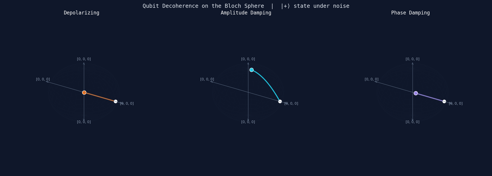
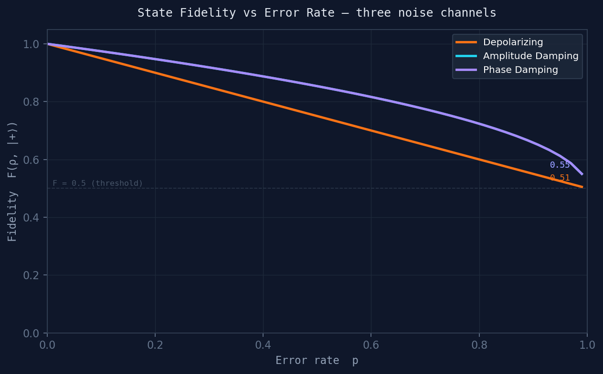
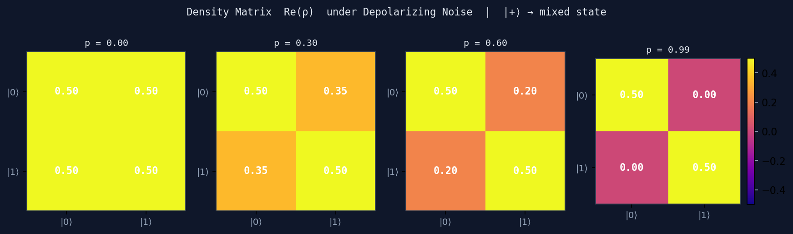

# Quantum Decoherence on the Bloch Sphere

**Bavanitha Sindhubabu** · [github.com/BavanithaS](https://github.com/BavanithaS)

A simulation of how three quantum noise channels degrade a qubit state, visualised on the Bloch sphere. Built with Qiskit Aer's density matrix simulator.

---

## What this project shows

A qubit in a pure state sits on the *surface* of the Bloch sphere — its state is fully known. When noise acts on it, the state moves *inward* toward the centre, which represents a maximally mixed state where all quantum information is lost. This inward collapse is decoherence.

This project simulates that process for three physically distinct noise channels:

| Channel | Physical meaning | Effect on Bloch sphere |
|---|---|---|
| **Depolarizing** | Random Pauli errors (X, Y, Z with equal probability) | Shrinks uniformly toward centre |
| **Amplitude damping** | Energy loss — qubit relaxes from \|1⟩ to \|0⟩ (T₁ relaxation) | Collapses toward north pole \|0⟩ |
| **Phase damping** | Phase information lost without energy loss (T₂ dephasing) | Collapses toward Z-axis, X/Y components vanish |

The distinction matters: amplitude damping models spontaneous emission in superconducting qubits and trapped ions; phase damping models environmental fluctuations that destroy superposition without flipping the qubit. Real quantum hardware suffers from both simultaneously.

---

## Outputs

### 1. Bloch sphere trajectories (`bloch_trajectories.png` / `bloch_decoherence.gif`)



Each panel shows the path of the Bloch vector as the error rate *p* increases from 0 to 1. Starting from |+⟩ (equator of the sphere):
- **Depolarizing** spirals directly to the centre
- **Amplitude damping** curves up toward |0⟩ (north pole) as the qubit relaxes
- **Phase damping** collapses toward the Z-axis — the X and Y components decay while Z is preserved

The animated GIF (`bloch_decoherence.gif`) shows this as a continuous evolution.

### 2. Fidelity vs error rate (`fidelity_vs_error.png`)



Fidelity F(ρ_noisy, |+⟩) measures how close the noisy state is to the ideal |+⟩. At p=0, F=1 (perfect). The curves show:
- **Phase damping** drops fastest — superposition (the X/Y components) is exactly what |+⟩ is built on
- **Amplitude damping** converges to F=0.5 at p=1 (the qubit is in |0⟩, which overlaps 50% with |+⟩)
- **Depolarizing** drops to F=0.5 at p=1 (maximally mixed state)

### 3. Density matrix evolution (`density_matrix_evolution.png`)



The real part of the density matrix Re(ρ) at p = 0, 0.3, 0.6, 0.99 under depolarizing noise. The off-diagonal elements (coherences) decay to zero as the state becomes mixed — this is the mathematical signature of decoherence.

At p=0: ρ = [[0.5, 0.5], [0.5, 0.5]] — pure |+⟩ state, coherences intact  
At p=1: ρ = [[0.5, 0], [0, 0.5]] — maximally mixed, all coherence lost

---

## Connection to quantum hardware

These noise models correspond directly to what happens in real quantum processors:

- **Superconducting qubits** (IBM, Google): dominated by T₁ (amplitude damping) and T₂ (phase damping) relaxation at cryogenic temperatures
- **Trapped ions**: longer coherence times but still subject to dephasing from laser noise and motional heating
- **Photonic qubits**: amplitude damping from photon loss in waveguides

Understanding how each channel degrades state fidelity is prerequisite to designing error mitigation strategies — zero-noise extrapolation, probabilistic error cancellation, and eventually full fault-tolerant error correction.

---

## Background: why |+⟩?

|+⟩ = (|0⟩ + |1⟩)/√2 sits on the equator of the Bloch sphere, midway between |0⟩ and |1⟩. It is maximally sensitive to both amplitude damping (which has a preference for |0⟩) and phase damping (which destroys X/Y coherence). Starting here makes the differences between channels most visible.

---

## How to run

```bash
pip install qiskit qiskit-aer numpy matplotlib pillow
python bloch_noise.py
```

Outputs saved to the working directory:
- `bloch_trajectories.png` — static Bloch sphere comparison
- `bloch_decoherence.gif` — animated decoherence evolution
- `fidelity_vs_error.png` — fidelity curves for all three channels
- `density_matrix_evolution.png` — Re(ρ) heatmaps at four error rates

GIF rendering takes ~30 seconds.

---

## Dependencies

| Package | Purpose |
|---|---|
| `qiskit` | Quantum circuit construction |
| `qiskit-aer` | Density matrix simulation with noise models |
| `numpy` | Numerical computation |
| `matplotlib` | All visualisations and animation |
| `pillow` | GIF export |

---

## Related projects

- [quantum_wavepacket](https://github.com/BavanithaS/quantum_wavepacket) — 1D wave packet dynamics via Split-Step Fourier Method
- [qft-vs-fft-spectrum-analyser](https://github.com/BavanithaS/qft-vs-fft-spectrum-analyser) — QFT vs FFT: circuit implementation and complexity analysis
